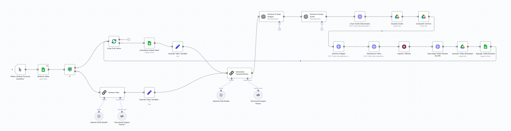

# 🎬 Videos-IA Workflow - n8n

Workflow built in **n8n** to automate the creation of **short vertical videos (9:16)** with optimized costs.  
It integrates multiple AI tools to generate text, audio, images, and renders, and manages results via Google Sheets and Google Drive.  

---

## 🚀 Executive Summary

This workflow automates video creation by:

- Generating **ideas** with OpenAI (if none are pending in Google Sheets).
- Creating a **visual prompt** (for image generation).
- Creating a **musical/audio prompt** and producing a **short audio (7s)** with ElevenLabs.
- Saving and sharing the audio in Google Drive.
- Generating an **image with Replicate (Flux 1.1 Pro)**.
- Composing the **final video** with Creatomate (using a template with text + image + audio).
- Exporting and saving the rendered video in Google Drive.
- Registering results (URL, texts, scenario) back into Google Sheets for review.

---

## 🛠️ Tech Stack

- **n8n** (workflow automation)
- **OpenAI** → idea + text prompts
- **ElevenLabs** → audio generation
- **Replicate (Flux 1.1 Pro)** → image generation
- **Creatomate** → video rendering and composition
- **Google Sheets + Drive** → task tracking, file storage

---

## 📂 Project Structure

```
Videos-IA-n8n/
│── Videos-IA-n8n.json    # Workflow export
│── README.md             # Project documentation
```

---

## 🔑 Required Credentials

- OpenAI API Key  
- ElevenLabs API Key  
- Replicate API Key  
- Creatomate API Key  
- Google Sheets & Drive credentials (for integration)

> ⚠️ Credentials should never be uploaded to the repo. Configure them securely in **n8n**.

---

## 📊 Example Workflow

Below is a high-level view of the workflow execution:



---

## 👨‍💻 Author

Francisco Moyano Escalera  
Specialist in Data, AI & Automation  
📧 frannmmm419@gmail.com  
🌐 GitHub: [franm419](https://github.com/franm419)

